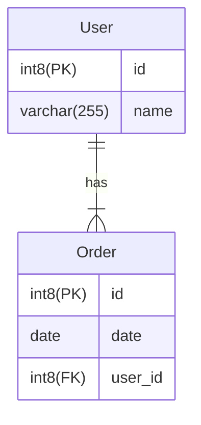

# Springboot
* One-to-many relationship.
* Code first approach.


Generated SQL code 
```roomsql
CREATE TABLE _order (
    id INT8 GENERATED BY DEFAULT AS IDENTITY,
    date DATE NOT NULL,
    user_id INT8 NOT NULL,
    PRIMARY KEY (id)
);
CREATE TABLE _user (
    id INT8 GENERATED BY DEFAULT AS IDENTITY,
    name VARCHAR(255) NOT NULL,
    PRIMARY KEY (id)
);
ALTER TABLE IF EXISTS _order ADD CONSTRAINT 'fk_order_user' FOREIGN KEY(user_id) REFERENCES _user;
```